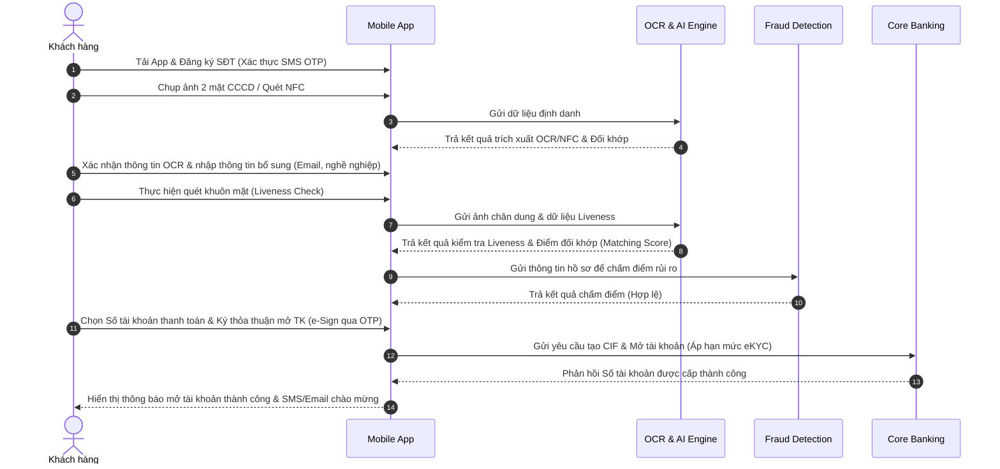

# TÀI LIỆU PHÂN TÍCH NGHIỆP VỤ HỆ THỐNG MỞ TÀI KHOẢN TRỰC TUYẾN QUA eKYC (ABC BANK)
## BẢN ĐẶC TẢ NGHIỆP VỤ CUỐI CÙNG (FINAL BUSINESS ANALYSIS SPECIFICATION)

---

## 1. Giới thiệu

Trong chiến lược chuyển đổi số giai đoạn mới, ngân hàng số ABC Bank hướng tới việc số hóa toàn diện hành trình trải nghiệm của khách hàng. Quy trình mở tài khoản truyền thống tại quầy giao dịch đang bộc lộ nhiều hạn chế về mặt thời gian, chi phí vận hành và rào cản địa lý đối với khách hàng mới. 

Hệ thống mở tài khoản trực tuyến qua eKYC (**ABC eKYC Account Opening System**) được xây dựng như một giải pháp đột phá, tích hợp trực tiếp trên ứng dụng ngân hàng di động (Mobile Banking App). Hệ thống ứng dụng các công nghệ trí tuệ nhân tạo tiên tiến như nhận dạng ký tự quang học (OCR), quét chip bảo mật CCCD qua sóng cận trường (NFC) và kiểm tra thực thể sống (Liveness Check) nhằm định danh khách hàng trực tuyến một cách an toàn, nhanh chóng và chính xác. 

Tài liệu này đặc tả toàn bộ yêu cầu nghiệp vụ, yêu cầu chức năng, phi chức năng, các quy tắc nghiệp vụ, kịch bản người dùng (User Stories) và các ca sử dụng (Use Cases) của hệ thống eKYC, phục vụ làm cơ sở kỹ thuật thống nhất để bàn giao cho đội ngũ phát triển và kiểm thử sản phẩm.

---

## 2. Mục tiêu

Hệ thống eKYC được thiết kế nhằm đạt được các mục tiêu cốt lõi sau:

*   **Tự động hóa hoàn toàn luồng nghiệp vụ sạch (Zero Manual Operation - STP Rate >= 85%):** Hệ thống tự động phê duyệt và cấp số tài khoản cho khách hàng ngay lập tức khi hồ sơ hợp lệ mà không cần bất kỳ sự can thiệp thủ công nào từ giao dịch viên Back-office.
*   **Tối ưu hóa thời gian xử lý:** Đảm bảo thời gian hoàn tất quy trình từ khâu chụp ảnh giấy tờ đến cấp số tài khoản thanh toán dưới **3 phút** đối với luồng tự động chuẩn.
*   **Nâng cao tỷ lệ chuyển đổi khách hàng mới (Acquisition & Conversion Rate):** Thiết kế giao diện tối giản, trực quan và các chỉ dẫn tương tác thời gian thực để giảm tỷ lệ người dùng rời bỏ ứng dụng giữa chừng xuống dưới **30%**.
*   **Bảo mật tối đa & Tuân thủ pháp lý:** Kiểm soát chặt chẽ rủi ro gian lận định danh với tỷ lệ tài khoản giả mạo mở thành công dưới **0.05%**; tuân thủ nghiêm ngặt các quy định về chống rửa tiền (AML) và bảo vệ dữ liệu cá nhân của Ngân hàng Nhà nước.

---

## 3. Actors (Các tác nhân hệ thống)

Tác nhân tương tác trực tiếp hoặc gián tiếp với hệ thống bao gồm:

*   **Khách hàng cá nhân (End User):** Người dùng trực tiếp sử dụng ứng dụng di động ABC Bank để đăng ký thông tin cá nhân, thực hiện quét CCCD/NFC và quét khuôn mặt sinh trắc học để mở tài khoản.
*   **Hệ thống OCR & AI Engine (OCR/AI System):** Thành phần công nghệ xử lý trích xuất văn bản từ ảnh chụp CCCD, kiểm tra tính hợp lệ của giấy tờ và thực hiện so khớp khuôn mặt (Face Matching).
*   **Hệ thống Core Banking (Core System):** Hệ thống ngân hàng lõi nhận dữ liệu khách hàng để tạo hồ sơ khách hàng trực tuyến (CIF), áp hạn mức eKYC và mở tài khoản thanh toán.
*   **Dịch vụ Xác thực Căn cước công dân (ID Verification Service - ví dụ: C06):** Hệ thống bên thứ ba phục vụ kiểm tra đối chiếu dữ liệu thẻ CCCD gắn chip (qua NFC) hoặc cơ sở dữ liệu dân cư quốc gia để xác thực tính chính xác của thông tin giấy tờ.
*   **Hệ thống Giao dịch viên / Kiểm soát viên Back-office (Operator):** Người dùng nội bộ được phân quyền để xử lý, phê duyệt hoặc từ chối thủ công đối với các hồ sơ eKYC nằm trong vùng nghi vấn kỹ thuật.
*   **Hệ thống Giám sát Gian lận (Fraud Detection System):** Hệ thống phân tích hành vi thiết bị, địa chỉ IP và chấm điểm rủi ro đăng ký để cảnh báo sớm các hành vi lừa đảo hoặc mở tài khoản ảo hàng loạt.
*   **Hệ thống Thông báo (Notification System):** Gửi mã OTP xác thực qua SMS và gửi email/thông báo thông tin tài khoản thành công cho khách hàng.

---

## 4. Business Flow (Luồng nghiệp vụ)

### Chi tiết luồng nghiệp vụ chuẩn:
1.  **Xác thực thông tin liên hệ ban đầu:** Khách hàng tải App, nhập số điện thoại cá nhân. Hệ thống gửi mã OTP qua SMS để xác thực số điện thoại chính chủ.
2.  **Cung cấp giấy tờ định danh (CCCD):** Khách hàng thực hiện chụp trực tiếp 2 mặt CCCD. Khuyến khích khách hàng quét chip NFC trên CCCD gắn chip (đối với thiết bị hỗ trợ NFC) để đạt độ chính xác dữ liệu tối đa.
3.  **Trích xuất thông tin & Xác nhận:** Hệ thống OCR tự động trích xuất thông tin văn bản từ ảnh chụp/NFC. Khách hàng đối chiếu, xác nhận thông tin định danh và nhập thêm một số thông tin phụ (Email, nghề nghiệp, chức vụ).
4.  **Xác thực khuôn mặt (Liveness Check):** Khách hàng quét camera trước để thực hiện kiểm tra thực thể sống theo hướng dẫn cử động thời gian thực của ứng dụng.
5.  **AI Đối sánh & Chấm điểm rủi ro:**
    *   Hệ thống so sánh ảnh chụp khuôn mặt thực tế với ảnh chân dung trên CCCD để trả về điểm đối khớp sinh trắc học.
    *   Hệ thống tự động tra cứu thông tin khách hàng trên Danh sách đen AML/PEP.
    *   Hệ thống chấm điểm rủi ro thiết bị và địa chỉ IP đăng ký.
6.  **Chọn số tài khoản & Ký thỏa thuận điện tử (e-Sign):** Khách hàng tìm kiếm và lựa chọn số tài khoản thanh toán theo ý thích. Tiếp theo, khách hàng xem bản điều khoản và xác nhận ký thỏa thuận điện tử mở tài khoản thông qua nhập mã OTP xác thực.
7.  **Cấp tài khoản tự động (Luồng STP):** Nếu tất cả bước xác thực đều hợp lệ và vượt qua các ngưỡng an toàn, hệ thống tự động đẩy dữ liệu sang Core Banking để tạo hồ sơ khách hàng mới (CIF), cấu hình hạn mức giao dịch eKYC ban đầu, mở tài khoản thanh toán và thông báo thành công cho khách hàng qua ứng dụng và SMS/Email.

---

## 5. Functional Requirements (Yêu cầu chức năng)

| ID | Tên chức năng | Mô tả yêu cầu |
| :--- | :--- | :--- |
| **FR-01** | Xác thực SĐT qua OTP | Hệ thống gửi mã SMS OTP độ dài 6 chữ số, hiệu lực trong 120 giây. Hỗ trợ khóa phiên nếu nhập sai quá 3 lần để phòng chống brute-force. |
| **FR-02** | Nhận diện giấy tờ (OCR) | Tự động phân biệt loại CCCD; trích xuất chính xác các thông tin: Họ tên, Số CCCD, Ngày sinh, Giới tính, Quê quán, Địa chỉ thường trú, Ngày hết hạn. |
| **FR-03** | Đọc dữ liệu NFC CCCD | Hỗ trợ đọc dữ liệu từ chip bảo mật trên CCCD gắn chip bằng sóng NFC trên điện thoại di động để lấy thông tin định danh gốc của Bộ Công an. |
| **FR-04** | Kiểm tra Liveness Check | Kích hoạt camera trước, hướng dẫn khách hàng thực hiện các cử động (quay đầu, chớp mắt, cười) nhằm chứng minh thực thể sống đang thao tác trực tiếp. |
| **FR-05** | Đối khớp khuôn mặt | So khớp sinh trắc học khuôn mặt chụp trực tiếp với ảnh trên CCCD và ảnh trong chip NFC (nếu có), trả về điểm số tương đồng theo phần trăm. |
| **FR-06** | Tra cứu danh sách đen (AML Check) | Tự động đối chiếu thông tin định danh khách hàng với danh sách cấm/rửa tiền và danh sách PEP của Ngân hàng và các tổ chức quốc tế. |
| **FR-07** | Tự động tạo CIF & Tài khoản | Khởi tạo mã CIF trực tuyến trên Core Banking và kích hoạt số tài khoản thanh toán cho hồ sơ vượt qua eKYC. |
| **FR-08** | Gửi thông báo tự động | Gửi SMS/Email chào mừng kèm thông tin số tài khoản thanh toán đã mở thành công cho khách hàng. |
| **FR-09** | Ký thỏa thuận mở tài khoản điện tử (e-Sign) | Hiển thị bản thỏa thuận mở và sử dụng tài khoản thanh toán trực tuyến. Khách hàng bấm ký kết thông qua phương thức nhập mã SMS OTP xác nhận. |
| **FR-10** | Chọn số tài khoản thanh toán | Cho phép khách hàng tìm kiếm và lựa chọn số tài khoản thanh toán theo số điện thoại, ngày sinh hoặc số tài khoản đẹp phong thủy. |
| **FR-11** | Cấu hình hạn mức giao dịch eKYC | Tự động áp đặt hạn mức giao dịch ban đầu cho tài khoản eKYC trên hệ thống Core Banking (Tối đa 100 triệu VNĐ/tháng). |

---

## 6. Non-Functional Requirements (Yêu cầu phi chức năng)

### A. Yêu cầu Hiệu năng (Performance Requirements)
*   **Thời gian xử lý giao dịch:**
    *   Thời gian phản hồi kết quả OCR từ khi chụp xong không quá **3 giây**.
    *   Thời gian xử lý đối khớp khuôn mặt và Liveness Check không quá **5 giây**.
    *   Thời gian hoàn tất giao dịch mở tài khoản (kể từ khi khách hàng nhấn xác nhận cuối cùng đến khi có số tài khoản) không quá **10 giây**.
*   **Độ chịu tải hệ thống (Scalability & Load):**
    *   Hệ thống eKYC APIs & OCR Engine đáp ứng tối thiểu **200 giao dịch đồng thời trên giây (TPS)** tại giờ cao điểm mà không làm tăng thời gian phản hồi.
    *   Cơ sở dữ liệu lưu trữ được thiết kế sẵn sàng mở rộng dung lượng khi số lượng tài khoản đăng ký tăng đột biến (> 20.000 hồ sơ/ngày).
*   **Thời gian lưu trữ dữ liệu (Data Retention):** Hình ảnh CCCD và video/ảnh quét khuôn mặt phải được lưu trữ an toàn trong kho dữ liệu lưu trữ của ngân hàng trong thời gian tối thiểu **5 năm** kể từ ngày khách hàng đóng tài khoản (theo quy định Phòng chống rửa tiền).

### B. Yêu cầu Bảo mật (Security & Compliance)
*   **Chống can thiệp thiết bị (App Shielding):**
    *   **SEC-01 (Jailbreak / Root Detection):** Ứng dụng di động tự động phát hiện và khóa luồng eKYC trên các thiết bị đã bị bẻ khóa (Jailbreak trên iOS hoặc Root trên Android) để ngăn chặn bypass camera bằng các công cụ giả lập API.
*   **Bảo mật đường truyền & Xác thực API:**
    *   **SEC-02 (SSL Pinning):** Bắt buộc sử dụng kỹ thuật SSL Pinning giữa Mobile App và API Gateway để ngăn chặn tấn công nghe lén/giả mạo Man-in-the-Middle (MitM).
    *   Mã hóa dữ liệu nhạy cảm (số CCCD, số điện thoại, dữ liệu sinh trắc học) theo tiêu chuẩn **AES-256** khi lưu trữ và **HTTPS (TLS 1.3)** khi truyền tải.
*   **Phòng chống rò rỉ thông tin cá nhân (PII Protection):**
    *   **SEC-03 (Screen Masking & Screenshot Block):** Ứng dụng che mờ màn hình chụp CCCD/nhập mã OTP khi khách hàng chuyển đổi sang ứng dụng khác (multitask) và chặn chụp ảnh/quay màn hình (Screenshot Block) đối với hệ điều hành Android.
    *   Không lưu trữ ảnh chụp khuôn mặt hay ảnh CCCD ở bộ nhớ đệm của thiết bị di động khách hàng (Local Storage) sau khi kết thúc phiên eKYC.
    *   Hệ thống quản lý định danh tuân thủ Luật Bảo vệ dữ liệu cá nhân (Nghị định 13/2023/NĐ-CP).

### C. Tính sẵn sàng (Availability)
*   Hệ thống eKYC và các API liên kết hoạt động liên tục **24/7/365**, tỷ lệ Uptime cam kết tối thiểu **99.9%** (SLA).

### D. Trải nghiệm người dùng (Usability)
*   Giao diện thân thiện, có khung hướng dẫn căn chỉnh camera khi chụp CCCD và quét mặt.
*   Hỗ trợ thông báo bằng giọng nói (Voice Guidance) cho khách hàng trong quá trình quét khuôn mặt.

---

## 7. Business Rules (Quy tắc nghiệp vụ)

*   **BR-01 (Độ tuổi hợp lệ):** Khách hàng phải từ đủ **18 tuổi** trở lên (tính theo ngày, tháng, năm sinh trích xuất từ CCCD so với ngày hiện tại).
*   **BR-02 (Tính hiệu lực của giấy tờ):** CCCD được chụp phải còn hạn sử dụng. Ngày hết hạn trên CCCD phải lớn hơn Ngày hiện tại.
*   **BR-03 (Quốc tịch):** Chỉ chấp nhận khách hàng có quốc tịch **Việt Nam**.
*   **BR-04 (Ngưỡng đối khớp khuôn mặt):**
    *   **Thành công tự động (Pass):** Điểm đối khớp khuôn mặt (Face Matching Score) **>= 85%**.
    *   **Cần kiểm duyệt thủ công (Review):** Điểm đối khớp nằm trong khoảng **từ 70% đến dưới 85%**.
    *   **Từ chối tự động (Fail):** Điểm đối khớp **< 70%**.
*   **BR-05 (Giới hạn thử lại - Retry Limit):** Trong một phiên đăng ký (Session), khách hàng được phép chụp lại CCCD tối đa **3 lần** và quét khuôn mặt tối đa **3 lần**. Nếu vượt quá giới hạn này mà vẫn thất bại, hệ thống sẽ khóa số điện thoại/thiết bị này không cho đăng ký trong vòng **24 giờ**.
*   **BR-06 (Quy tắc AML):** Bất kỳ thông tin khách hàng nào trùng khớp với danh sách đen (PEP hoặc AML Blacklist) sẽ bị hệ thống tự động từ chối mở tài khoản ngay lập tức mà không cần chuyển luồng kiểm duyệt thủ công.
*   **BR-07 (Chống trùng lặp Giấy tờ tùy thân - Deduplication Rule):** Một số CCCD chỉ được liên kết với duy nhất **1 mã CIF** tại ABC Bank.
*   **BR-08 (Chống trùng lặp Số điện thoại):** Một số điện thoại chỉ được đăng ký làm thông tin liên lạc chính của tối đa **1 mã CIF** đang hoạt động tại ngân hàng.
*   **BR-09 (Thời gian hết hạn phiên - Session Timeout):** Phiên đăng ký eKYC tự động bị hủy nếu khách hàng không thực hiện bất kỳ tương tác màn hình nào quá **5 phút**.

---

## 8. Assumptions (Các giả định)

*   **Giả định 1:** ABC Bank đã hoàn tất việc kết nối kỹ thuật và ký kết hợp đồng thương mại với các đơn vị cung cấp giải pháp xác thực dữ liệu dân cư quốc gia (hoặc đối tác trung gian được Bộ Công an cấp phép) để đối soát thông tin CCCD gắn chip qua NFC.
*   **Giả định 2:** Thiết bị di động của khách hàng có camera hoạt động bình thường, độ phân giải tối thiểu 5 Megapixels và có kết nối mạng (4G/Wi-Fi) ổn định trong quá trình thực hiện eKYC.
*   **Giả định 3:** Khách hàng thực hiện đăng ký chưa từng tồn tại thông tin CIF (khách hàng mới hoàn toàn) tại ABC Bank.
*   **Giả định 4:** Hệ thống Core Banking của ABC Bank hỗ trợ cơ chế tạo CIF và mở tài khoản 24/7, kể cả trong khung giờ chạy EOD (thường là 22h00 - 00h00 hàng ngày), hoặc có hàng đợi (Queue) lưu tạm giao dịch để xử lý bù mà không báo lỗi trực tiếp tới khách hàng.

---

## 9. User Stories (Kịch bản người dùng)

### US-01: Đăng ký số điện thoại và xác thực OTP
*   **User Story:**
    *   **As a** Khách hàng cá nhân,
    *   **I want to** nhập số điện thoại di động và thực hiện xác thực bằng mã SMS OTP,
    *   **So that** tôi có thể khởi tạo phiên đăng ký tài khoản an toàn và đảm bảo số điện thoại chính chủ thuộc sở hữu của tôi.
*   **Mức độ ưu tiên:** High
*   **Business Value:** Thiết lập kênh giao tiếp bảo mật với khách hàng ngay từ đầu, giảm thiểu rủi ro sử dụng số điện thoại rác hoặc số điện thoại của người khác để mở tài khoản.
*   **Acceptance Criteria (Tiêu chí nghiệm thu):**
    1. Khách hàng chỉ được nhập số điện thoại hợp lệ theo định dạng viễn thông Việt Nam (10 chữ số, bắt đầu bằng các đầu số nhà mạng được cấp phép).
    2. Hệ thống gửi mã OTP độ dài 6 chữ số qua tin nhắn SMS đến số điện thoại đăng ký trong vòng tối đa **30 giây** kể từ khi yêu cầu.
    3. Mã OTP có thời hạn hiệu lực là **120 giây**. Quá thời gian này, mã OTP sẽ mất hiệu lực và khách hàng phải nhấn "Gửi lại OTP".
    4. Khách hàng nhập đúng OTP sẽ tự động được chuyển sang bước tiếp theo (Chụp ảnh giấy tờ).
    5. Nếu khách hàng nhập sai OTP quá **3 lần**, hệ thống sẽ khóa chức năng đăng ký đối với số điện thoại đó trong vòng **24 giờ** để phòng chống brute-force.

---

### US-02: Chụp ảnh CCCD và trích xuất OCR tự động
*   **User Story:**
    *   **As a** Khách hàng cá nhân,
    *   **I want to** chụp ảnh mặt trước và mặt sau của Căn cước công dân (CCCD) thông qua camera điện thoại,
    *   **So that** hệ thống tự động điền các thông tin cá nhân của tôi vào đơn đăng ký mà tôi không cần phải gõ tay thủ công.
*   **Mức độ ưu tiên:** High
*   **Business Value:** Rút ngắn thời gian đăng ký, hạn chế tối đa sai sót gõ nhầm thông tin và tối ưu hóa trải nghiệm khách hàng ở bước nhập liệu (giảm tỷ lệ rơi rụng).
*   **Acceptance Criteria (Tiêu chí nghiệm thu):**
    1. Ứng dụng kích hoạt camera sau và hiển thị khung định vị (overlay) hướng dẫn đặt CCCD khớp với khung hình.
    2. Hệ thống tự động phát hiện và kiểm tra chất lượng ảnh thời gian thực (đủ độ sáng, ảnh không bị mờ, không bị lóa sáng, không bị mất góc giấy tờ). Nếu không đạt, hiển thị cảnh báo ngay trên màn hình để hướng dẫn người dùng điều chỉnh trước khi bấm chụp.
    3. OCR trích xuất chính xác các trường dữ liệu bắt buộc: Họ tên, Số CCCD, Ngày sinh, Giới tính, Quê quán, Địa chỉ thường trú, Ngày hết hạn.
    4. Hiển thị màn hình kết quả trích xuất để khách hàng đối chiếu. Cho phép khách hàng chỉnh sửa các trường thông tin bổ sung hoặc sửa lỗi chính tả nhỏ từ OCR (ngoại trừ trường Số CCCD không cho phép chỉnh sửa thủ công để đảm bảo an toàn).

---

### US-03: Đọc chip NFC trên CCCD gắn chip
*   **User Story:**
    *   **As a** Khách hàng cá nhân có điện thoại hỗ trợ công nghệ NFC,
    *   **I want to** quét chip bảo mật của CCCD gắn chip bằng đầu đọc NFC trên điện thoại di động,
    *   **So that** tôi được xác thực thông tin gốc từ Bộ Công An và hồ sơ của tôi đạt độ tin cậy cao nhất để mở các gói hạn mức tài khoản lớn.
*   **Mức độ ưu tiên:** Medium (Phụ thuộc vào phần cứng thiết bị của khách hàng).
*   **Business Value:** Loại bỏ hoàn toàn rủi ro sử dụng CCCD giả vật lý, nâng cao tính chính xác của dữ liệu xác thực lên mức 100%, tạo tiền đề nâng hạn mức giao dịch cho khách hàng ngay lập tức.
*   **Acceptance Criteria (Tiêu chí nghiệm thu):**
    1. Hệ thống tự động kiểm tra phần cứng thiết bị của khách hàng có hỗ trợ NFC hay không. Nếu có, hiển thị tùy chọn/hướng dẫn quét NFC bằng cách áp CCCD gắn chip vào vùng anten NFC trên điện thoại.
    2. Đọc thành công dữ liệu mã hóa lưu trong chip bảo mật bao gồm: Thông tin văn bản gốc và ảnh chân dung chất lượng cao của khách hàng.
    3. Xác thực thành công tính hợp lệ của chữ ký số (Digital Signature) trên chip CCCD ký bởi Bộ Công An.
    4. Nếu thiết bị không hỗ trợ NFC hoặc quét NFC thất bại sau 3 lần thử, ứng dụng tự động hiển thị nút chuyển hướng về luồng eKYC chụp ảnh 2 mặt CCCD truyền thống (US-02) làm phương án dự phòng.

---

### US-04: Xác thực sinh trắc học khuôn mặt (Liveness Check)
*   **User Story:**
    *   **As a** Khách hàng cá nhân,
    *   **I want to** thực hiện quét khuôn mặt bằng camera trước theo các hướng dẫn hành động tương tác động,
    *   **So that** hệ thống xác nhận tôi là một thực thể sống đang trực tiếp thao tác tại thời điểm đăng ký (không phải ảnh chụp hay video của tôi).
*   **Mức độ ưu tiên:** High
*   **Business Value:** Ngăn chặn triệt để các cuộc tấn công giả định bằng hình ảnh in sẵn, video phát lại trên màn hình khác hoặc mặt nạ 3D (Anti-spoofing).
*   **Acceptance Criteria (Tiêu chí nghiệm thu):**
    1. Ứng dụng kích hoạt camera trước, hiển thị khung hình tròn định vị và hướng dẫn khoảng cách phù hợp.
    2. Hệ thống yêu cầu khách hàng thực hiện ngẫu nhiên ít nhất 2 hành động tương tác (ví dụ: chớp mắt, quay đầu sang trái/phải, mở miệng hoặc cười nhẹ) để kiểm tra cử động thực tế.
    3. Công nghệ AI phân tích các yếu tố chiều sâu, độ phản xạ ánh sáng trên da khuôn mặt để xác định thực thể sống và trả kết quả (Đạt/Không Đạt) trong vòng tối đa **5 giây**.
    4. Nếu phát hiện dấu hiệu giả mạo sinh trắc học, hệ thống lập tức báo lỗi, khóa luồng giao dịch hiện tại và gửi log cảnh báo kèm thông tin IP/Thiết bị về hệ thống phòng chống gian lận.

---

### US-05: Đối so khớp khuôn mặt (Face Matching)
*   **User Story:**
    *   **As a** Khối Quản trị Rủi ro & Tuân thủ,
    *   **I want** hệ thống tự động so khớp ảnh chụp khuôn mặt thực tế của khách hàng với ảnh chân dung trên CCCD (hoặc ảnh gốc trong chip NFC),
    *   **So that** ngân hàng đảm bảo người đang thực hiện đăng ký và người sở hữu giấy tờ tùy thân là cùng một người duy nhất.
*   **Mức độ ưu tiên:** High
*   **Business Value:** Chống gian lận sử dụng giấy tờ tùy thân của người khác (nhặt được hoặc đánh cắp) để mở tài khoản thanh toán bất hợp pháp.
*   **Acceptance Criteria (Tiêu chí nghiệm thu):**
    1. Thuật toán AI tự động so sánh các đặc điểm sinh trắc học của ảnh chụp từ bước Liveness Check (US-04) và ảnh chân dung trích xuất từ CCCD (US-02/US-03).
    2. Hệ thống trả về điểm đối khớp tương đồng (Matching Score) dưới dạng tỷ lệ phần trăm (%).
    3. **Quy tắc phân luồng theo điểm số:**
        *   **Face Matching Score >= 85%:** Đạt yêu cầu đối khớp khuôn mặt tự động (Chuyển sang luồng tạo tài khoản STP).
        *   **70% <= Face Matching Score < 85%:** Gắn nhãn trạng thái "Pending Review" để chuyển sang bộ phận vận hành hậu kiểm (US-08).
        *   **Face Matching Score < 70%:** Từ chối mở tài khoản tự động (Fail).

---

### US-06: Tự động kiểm tra danh sách đen và Chống rửa tiền (AML Check)
*   **User Story:**
    *   **As a** Khối Quản trị Rủi ro & Tuân thủ,
    *   **I want** hệ thống tự động đối chiếu thông tin cá nhân khách hàng với cơ sở dữ liệu danh sách đen, danh sách cấm vận và PEP của ngân hàng,
    *   **So that** chúng tôi ngăn chặn việc mở tài khoản cho các đối tượng có rủi ro rửa tiền hoặc vi phạm pháp luật theo đúng quy định của Ngân hàng Nhà nước.
*   **Mức độ ưu tiên:** High
*   **Business Value:** Đảm bảo tuân thủ tuyệt đối quy định pháp lý (Compliance), bảo vệ danh tiếng và tránh các chế tài phạt tài chính nặng từ cơ quan quản lý.
*   **Acceptance Criteria (Tiêu chí nghiệm thu):**
    1. Ngay sau khi thông tin cá nhân được xác định qua bước OCR/NFC, hệ thống tự động gọi API đối soát với danh sách đen nội bộ, danh sách cảnh báo của NHNN và danh sách PEP (Chính trị gia/Người có liên quan).
    2. Quy trình đối soát so khớp dữ liệu dựa trên: Họ và tên (không dấu và có dấu), Ngày sinh, Số giấy tờ định danh (CCCD).
    3. Nếu phát hiện trùng khớp (Match): Hệ thống lập tức dừng quy trình mở tài khoản tự động, từ chối cấp tài khoản và ghi nhận log cảnh báo vào hệ thống AML giám sát.
    4. Nếu không phát hiện trùng khớp (AML Clean): Cho phép hồ sơ đi tiếp vào luồng phê duyệt tự động.

---

### US-07: Ký thỏa thuận mở tài khoản điện tử (e-Sign via OTP)
*   **User Story:**
    *   **As a** Khách hàng cá nhân,
    *   **I want to** xem bản điều khoản điều kiện và ký thỏa thuận mở tài khoản trực tuyến bằng cách nhập mã SMS OTP xác nhận,
    *   **So that** tôi hoàn tất các thủ tục pháp lý quy định để kích hoạt tài khoản sử dụng hợp lệ mà không cần ký giấy tờ trực tiếp.
*   **Mức độ ưu tiên:** High
*   **Business Value:** Đảm bảo tính pháp lý đầy đủ cho tài khoản trực tuyến, đáp ứng quy chuẩn của Ngân hàng Nhà nước về ký kết hợp đồng điện tử.
*   **Acceptance Criteria (Tiêu chí nghiệm thu):**
    1. Sau khi hoàn thành xác thực sinh trắc học và chọn số tài khoản, hệ thống hiển thị bản thỏa thuận mở và sử dụng tài khoản thanh toán ở dạng PDF/HTML trực quan.
    2. Khách hàng phải cuộn đọc hết bản thỏa thuận thì hệ thống mới kích hoạt nút "Ký thỏa thuận".
    3. Khách hàng bấm nút, hệ thống gửi mã SMS OTP xác thực ký số gồm 6 chữ số đến số điện thoại đăng ký (US-01).
    4. Khách hàng nhập chính xác mã OTP để ký thỏa thuận điện tử thành công, chuyển sang bước tạo tài khoản tự động (US-08).

---

### US-08: Tự động cấp mã CIF và Số tài khoản (Core Banking Integration)
*   **User Story:**
    *   **As a** Khách hàng cá nhân,
    *   **I want** hệ thống tự động cấp mã định danh khách hàng (CIF) và số tài khoản thanh toán trực tuyến cho tôi ngay sau khi các bước kiểm tra eKYC tự động đều đạt chuẩn,
    *   **So that** tôi có thể thực hiện nạp tiền và giao dịch chuyển tiền/thanh toán ngay lập tức mà không cần chờ bất kỳ ai phê duyệt.
*   **Mức độ ưu tiên:** High
*   **Business Value:** Thực hiện triệt để mục tiêu STP (Zero Manual Operation) cho các giao dịch hợp lệ, tối ưu hóa năng suất vận hành của ngân hàng và tối đa hóa sự hài lòng của khách hàng số.
*   **Acceptance Criteria (Tiêu chí nghiệm thu):**
    1. Đối với các hồ sơ thỏa mãn tất cả các điều kiện: Đăng ký thành công OTP, OCR/NFC hợp lệ, Liveness Đạt, Face Matching Score >= 85% và AML Clean.
    2. Hệ thống tự động thực hiện gọi API tích hợp sang Core Banking của ABC Bank để khởi tạo hồ sơ CIF khách hàng trực tuyến.
    3. Tự động thiết lập hạn mức giao dịch eKYC ban đầu tối đa 100 triệu VNĐ/tháng cho tài khoản thanh toán trực tuyến.
    4. Thời gian xử lý gọi API và tạo CIF/Tài khoản không quá **5 giây**.
    5. Ứng dụng di động hiển thị màn hình chúc mừng, hiển thị rõ ràng Số tài khoản thanh toán và Tên tài khoản, đồng thời gửi SMS/Email chúc mừng chứa thông tin tài khoản cho khách hàng.

---

### US-09: Chọn số tài khoản thanh toán mong muốn
*   **User Story:**
    *   **As a** Khách hàng cá nhân,
    *   **I want to** chọn số tài khoản thanh toán theo số điện thoại cá nhân hoặc tìm kiếm số tài khoản đẹp theo ý muốn,
    *   **So that** tôi sở hữu số tài khoản dễ nhớ và mang dấu ấn cá nhân phù hợp với nhu cầu sử dụng.
*   **Mức độ ưu tiên:** Medium
*   **Business Value:** Tính năng thương mại hóa giúp tăng sự gắn kết thương hiệu, thu hút khách hàng mới mở tài khoản và tạo doanh thu dịch vụ phụ trợ từ bán số tài khoản đẹp.
*   **Acceptance Criteria (Tiêu chí nghiệm thu):**
    1. Ở bước thiết lập tài khoản, hệ thống hiển thị tùy chọn: "Số tài khoản trùng Số điện thoại (Miễn phí)" hoặc "Tìm số tài khoản theo yêu cầu".
    2. Nếu khách hàng chọn số trùng số điện thoại, hệ thống tự động kiểm tra tính sẵn có trong kho số của Core Banking và tự động gán.
    3. Nếu khách hàng chọn tìm số tài khoản theo yêu cầu, hệ thống cung cấp thanh tìm kiếm (nhập đuôi số mong muốn, độ dài số). Hệ thống hiển thị danh sách các số tài khoản trống kèm theo phí mua số tương ứng (bao gồm số miễn phí và số thu phí từ thấp đến cao).
    4. Hệ thống giữ số tài khoản đã chọn trong vòng **15 phút** để khách hàng thực hiện các bước ký thỏa thuận và mở tài khoản tiếp theo. Quá thời gian này, số tài khoản sẽ tự động giải phóng về kho số chung.

---

### US-10: Phê duyệt hồ sơ ngoại lệ (Pending Review Dashboard)
*   **User Story:**
    *   **As a** Giao dịch viên Back-office (Operator),
    *   **I want to** xem và phê duyệt hoặc từ chối các hồ sơ eKYC bị hệ thống gắn cờ nghi ngờ/điểm đối khớp thấp trên trang Dashboard quản trị,
    *   **So that** tôi có thể dùng nghiệp vụ thủ công để xử lý các ca lỗi kỹ thuật nhẹ giúp giữ chân khách hàng nhưng vẫn bảo đảm an toàn bảo mật.
*   **Mức độ ưu tiên:** Medium
*   **Business Value:** Giảm tỷ lệ từ chối sai (False Reject Rate) do các yếu tố môi trường (ánh sáng chụp CCCD, khách hàng thay đổi ngoại hình nhẹ), tăng tỷ lệ chuyển đổi khách hàng thực tế.
*   **Acceptance Criteria (Tiêu chí nghiệm thu):**
    1. Cung cấp trang dashboard quản lý trực quan cho Giao dịch viên Back-office, phân quyền đăng nhập bảo mật (2FA).
    2. Trang Dashboard hiển thị danh sách hồ sơ trạng thái "Pending Review" theo thứ tự thời gian nộp đơn (FIFO).
    3. Giao diện chi tiết hồ sơ hiển thị song song: Ảnh chụp CCCD (mặt trước/mặt sau), ảnh quét khuôn mặt Liveness, Điểm đối khớp khuôn mặt (%) và các lỗi cảnh báo hệ thống gắn cờ (ví dụ: Chữ ký số NFC không trùng khớp, ảnh mờ...).
    4. Cung cấp 2 chức năng thao tác chính:
        *   **Phê duyệt (Approve):** Hệ thống gửi yêu cầu kích hoạt tài khoản sang Core Banking (tương tự luồng tự động).
        *   **Từ chối (Reject):** Hệ thống hủy hồ sơ đăng ký, yêu cầu Giao dịch viên chọn Lý do từ chối từ danh sách mẫu và gửi SMS thông báo kèm lý do phù hợp cho khách hàng.

---

## 10. Use Cases (Danh sách ca sử dụng)

### UC-01: Xác thực số điện thoại qua OTP
*   **Use Case ID:** UC-01
*   **Mục tiêu:** Xác minh tính chính chủ của số điện thoại do khách hàng đăng ký trước khi bắt đầu quy trình eKYC.
*   **Actor chính:** Khách hàng cá nhân
*   **Actor phụ:** Hệ thống thông báo (Notification System)
*   **Điều kiện tiên quyết:** Khách hàng cài đặt ứng dụng ABC Bank và chọn chức năng "Mở tài khoản trực tuyến".
*   **Điều kiện kết thúc:** Số điện thoại được xác thực thành công; phiên đăng ký eKYC được khởi tạo.
*   **Trigger:** Khách hàng nhập số điện thoại và bấm nút "Tiếp tục".
*   **Luồng chính (Main Flow):**
    1. Khách hàng nhập số điện thoại di động của mình vào form trên ứng dụng.
    2. Hệ thống kiểm tra tính hợp lệ của định dạng số điện thoại.
    3. Hệ thống tạo mã OTP gồm 6 chữ số ngẫu nhiên, lưu thời gian hiệu lực và gọi API Hệ thống thông báo để gửi SMS OTP đến thiết bị của khách hàng.
    4. Hệ thống hiển thị màn hình nhập mã OTP kèm đồng hồ đếm ngược 120 giây.
    5. Khách hàng nhận được tin nhắn SMS, lấy mã OTP và nhập vào ứng dụng.
    6. Hệ thống kiểm tra mã OTP khách hàng nhập so với mã đã lưu.
    7. Hệ thống xác thực mã OTP chính xác, khởi tạo phiên đăng ký eKYC thành công và chuyển khách hàng sang bước Chụp ảnh giấy tờ (UC-02).

---

### UC-02: Xác thực thông tin CCCD qua OCR/NFC
*   **Use Case ID:** UC-02
*   **Mục tiêu:** Chụp ảnh/quét thẻ CCCD để trích xuất dữ liệu định danh và xác minh tính hợp pháp của giấy tờ tùy thân.
*   **Actor chính:** Khách hàng cá nhân
*   **Actor phụ:** Hệ thống OCR & AI Engine, Dịch vụ Xác thực CCCD (Bộ Công An / Đối tác xác thực NFC)
*   **Điều kiện tiên quyết:** Xác thực số điện thoại (UC-01) thành công.
*   **Điều kiện kết thúc:** Thông tin CCCD được trích xuất chính xác và ghi nhận hợp lệ vào hồ sơ tạm thời.
*   **Trigger:** Hệ thống chuyển tiếp tự động sang bước quét giấy tờ sau khi UC-01 hoàn thành.
*   **Luồng chính (Main Flow - Quét NFC CCCD gắn chip):**
    1. Hệ thống nhận diện thiết bị của khách hàng hỗ trợ chức năng NFC.
    2. Hệ thống hướng dẫn khách hàng nhập các thông tin xác thực bắt buộc (hoặc quét mã QR trên mặt thẻ CCCD để tự động điền khóa giải mã chip).
    3. Hệ thống hiển thị hướng dẫn đặt áp thẻ CCCD gắn chip vào mặt sau của điện thoại để đọc NFC.
    4. Khách hàng đặt thẻ đúng vị trí, hệ thống đọc dữ liệu mã hóa lưu trên chip trong vòng **5 giây**.
    5. Hệ thống gửi dữ liệu đọc được lên Dịch vụ Xác thực để kiểm tra chữ ký số của Bộ Công An.
    6. Dịch vụ trả kết quả: Chữ ký số hợp lệ, thông tin khớp.
    7. Hệ thống điền thông tin văn bản trích xuất từ NFC lên form đăng ký và hiển thị ảnh chân dung gốc lấy từ chip CCCD.
    8. Khách hàng điền thêm các thông tin bắt buộc còn thiếu (Email, nghề nghiệp, chức vụ) và bấm "Xác nhận".
    9. Hệ thống chuyển khách hàng sang bước quét khuôn mặt (UC-03).
*   **Luồng thay thế (Alternative Flow - Chụp ảnh CCCD và OCR truyền thống):**
    *   **Tại bước 1 hoặc 4: Thiết bị không hỗ trợ NFC hoặc đọc NFC thất bại:**
        1. Hệ thống chuyển hướng khách hàng sang luồng chụp ảnh CCCD.
        2. Hệ thống yêu cầu chụp ảnh mặt trước của CCCD. Khách hàng chụp ảnh, hệ thống kiểm tra chất lượng ảnh thời gian thực.
        3. Hệ thống yêu cầu chụp ảnh mặt sau của CCCD. Khách hàng chụp ảnh, hệ thống kiểm tra chất lượng ảnh thời gian thực.
        4. Hệ thống gửi ảnh chụp về OCR & AI Engine để trích xuất thông tin.
        5. Hệ thống hiển thị form điền sẵn thông tin trích xuất. Cho phép khách hàng chỉnh sửa thông tin bị sai do OCR (trừ số CCCD).
        6. Khách hàng điền thêm email, địa chỉ liên lạc, nghề nghiệp và nhấn "Xác nhận".
        7. Hệ thống chuyển khách hàng sang bước quét khuôn mặt (UC-03).

---

### UC-03: Xác thực sinh trắc học khuôn mặt
*   **Use Case ID:** UC-03
*   **Mục tiêu:** Kiểm tra thực thể sống và so khớp ảnh chân dung thực tế của khách hàng với ảnh chân dung trên CCCD.
*   **Actor chính:** Khách hàng cá nhân
*   **Actor phụ:** Hệ thống OCR & AI Engine
*   **Điều kiện tiên quyết:** Hoàn thành xác thực thông tin CCCD (UC-02).
*   **Điều kiện kết thúc:** Hệ thống ghi nhận kết quả so khớp khuôn mặt đạt chuẩn hoặc chuyển luồng ngoại lệ hậu kiểm.
*   **Trigger:** Hệ thống chuyển tiếp tự động sang bước quét khuôn mặt sau khi UC-02 hoàn thành.
*   **Luồng chính (Main Flow - Phê duyệt tự động):**
    1. Hệ thống kích hoạt camera trước và hiển thị khung tròn định vị khuôn mặt trên màn hình.
    2. Hệ thống yêu cầu khách hàng giữ camera ngang tầm mắt và thực hiện ngẫu nhiên các cử động tương tác (Ví dụ: Chớp mắt, quay đầu).
    3. Khách hàng thực hiện cử động đúng theo hướng dẫn.
    4. Hệ thống chạy thuật toán AI phân tích để xác nhận thực thể sống (Liveness Check = True).
    5. Hệ thống tiến hành so so sánh ảnh khuôn mặt chụp thực tế với ảnh chân dung lấy từ CCCD (OCR hoặc NFC).
    6. Thuật toán trả về điểm đối khớp tương đồng (Matching Score) đạt **>= 85%**.
    7. Hệ thống ghi nhận kết quả xác thực khuôn mặt hợp lệ và chuyển sang bước Chọn số tài khoản & Ký thỏa thuận (e-Sign) trước khi gọi mở tài khoản tự động (UC-04).
*   **Luồng thay thế (Alternative Flow - Chuyển duyệt thủ công):**
    *   **Tại bước 6: Điểm đối khớp nằm trong khoảng nghi ngờ (70% <= Matching Score < 85%):**
        1. Hệ thống tự động ghi nhận trạng thái hồ sơ sinh trắc học là "Pending Review".
        2. Hệ thống hiển thị màn hình thông báo cho khách hàng: *"Yêu cầu của bạn đang được chúng tôi xử lý. Kết quả mở tài khoản sẽ được thông báo trong vòng 15-30 phút qua SMS/Email."*
        3. Đẩy hồ sơ sang luồng Phê duyệt ngoại lệ Back-office (UC-05).

---

### UC-04: Tự động tạo CIF và cấp số tài khoản (Luồng STP)
*   **Use Case ID:** UC-04
*   **Mục tiêu:** Thực hiện kiểm tra danh sách cấm/rửa tiền và tự động gọi API Core Banking để tạo hồ sơ khách hàng mới cùng số tài khoản thanh toán mà không cần con người xử lý.
*   **Actor chính:** Khách hàng cá nhân
*   **Actor phụ:** Hệ thống AML Check, Hệ thống Core Banking, Hệ thống thông báo (Notification System)
*   **Điều kiện tiên quyết:** UC-01, UC-02, UC-03 hoàn thành và kết quả đạt chuẩn tự động (Face Matching Score >= 85%). Khách hàng ký thỏa thuận dịch vụ điện tử thành công.
*   **Điều kiện kết thúc:** CIF khách hàng được tạo, tài khoản thanh toán được mở trên Core Banking, khách hàng nhận thông báo thành công.
*   **Trigger:** Khách hàng nhập thành công mã OTP xác thực ký thỏa thuận điện tử mở tài khoản.
*   **Luồng chính (Main Flow):**
    1. Hệ thống tự động kích hoạt API AML Check để đối chiếu Họ tên, Ngày sinh, Số CCCD của khách hàng với danh sách đen rửa tiền và danh sách PEP.
    2. Hệ thống AML Check trả về kết quả "Clean" (Không trùng khớp danh sách cấm).
    3. Hệ thống gửi yêu cầu tạo hồ sơ định danh CIF trực tuyến đến Hệ thống Core Banking.
    4. Hệ thống Core Banking khởi tạo CIF trực tuyến thành công.
    5. Hệ thống Core Banking tự động thực hiện mở Tài khoản thanh toán (theo số tài khoản khách hàng đã chọn ở bước trước), áp hạn mức eKYC ban đầu và phản hồi Số tài khoản về hệ thống eKYC.
    6. Hệ thống eKYC gửi yêu cầu gửi SMS/Email xác nhận chào mừng đến Hệ thống thông báo.
    7. Ứng dụng di động hiển thị màn hình chúc mừng, hiển thị rõ ràng Số tài khoản thanh toán và hướng dẫn khách hàng thiết lập mật khẩu đăng nhập lần đầu.

---

### UC-05: Phê duyệt hồ sơ ngoại lệ Back-office
*   **Use Case ID:** UC-05
*   **Mục tiêu:** Cho phép Giao dịch viên Back-office phê duyệt thủ công các hồ sơ eKYC có nghi vấn nhẹ hoặc điểm đối khớp khuôn mặt thấp nằm trong vùng cho phép (70% - 84%).
*   **Actor chính:** Giao dịch viên Back-office (Operator)
*   **Actor phụ:** Hệ thống Core Banking, Hệ thống thông báo (Notification System)
*   **Điều kiện tiên quyết:** Giao dịch viên đăng nhập thành công vào hệ thống Dashboard eKYC quản trị (2FA). Có hồ sơ đang nằm ở trạng thái "Pending Review".
*   **Điều kiện kết thúc:** Hồ sơ eKYC được phê duyệt thành công (tài khoản được kích hoạt trên Core Banking) hoặc bị từ chối chính thức bởi con người.
*   **Trigger:** Giao dịch viên chọn hồ sơ "Pending Review" trong hàng đợi chờ duyệt trên Dashboard.
*   **Luồng chính (Main Flow - Phê duyệt thành công):**
    1. Giao dịch viên mở xem chi tiết hồ sơ eKYC chờ duyệt.
    2. Hệ thống hiển thị trực quan thông tin trích xuất OCR, ảnh chụp CCCD 2 mặt, ảnh quét khuôn mặt thật của khách hàng, điểm đối khớp sinh trắc học do AI trả về và các cờ cảnh báo (Flags).
    3. Giao dịch viên đối soát thông tin bằng mắt thường và nhận thấy hình ảnh, thông tin hợp lệ (Ví dụ: Khách hàng đổi kiểu tóc nhẹ dẫn đến điểm so khớp chỉ đạt 78% nhưng các đường nét khuôn mặt cơ bản hoàn toàn trùng khớp).
    4. Giao dịch viên bấm nút "Phê duyệt" (Approve) và nhập ghi chú.
    5. Hệ thống gọi API Core Banking để tự động tạo CIF và Tài khoản thanh toán cho khách hàng (như luồng STP).
    6. Hệ thống cập nhật trạng thái hồ sơ thành "Approved" và kích hoạt gửi tin nhắn SMS/Email thông báo số tài khoản thành công cho khách hàng.

---

## 11. Exception Flows (Các kịch bản ngoại lệ)

Hệ thống eKYC được cấu hình tự động xử lý các tình huống lỗi nghiệp vụ cụ thể nhằm đảm bảo tính ổn định và tính sẵn dụng cao:

*   **Luồng ngoại lệ 01 (OCR không nhận diện được thông tin giấy tờ):**
    *   *Kịch bản:* Ảnh chụp CCCD bị lóa sáng, mờ, mất góc, hoặc khách hàng chụp giấy tờ không phải CCCD.
    *   *Xử lý:* Hệ thống hiển thị lỗi cảnh báo cụ thể (Ví dụ: *"Ảnh chụp bị lóa sáng ở góc trên. Vui lòng chụp lại ở nơi đủ ánh sáng và tắt flash"*), reset bước chụp giấy tờ và yêu cầu khách hàng thực hiện lại (tối đa 3 lần).
*   **Luồng ngoại lệ 02 (Xác thực Liveness Check thất bại):**
    *   *Kịch bản:* Khách hàng không thực hiện đúng cử động Liveness quá 3 lần, hoặc AI phát hiện hình ảnh quét từ camera trước là hình ảnh tái tạo (photo/video/deepfake).
    *   *Xử lý:* Hệ thống tự động từ chối giao dịch, lưu log rủi ro sinh trắc học và hiển thị thông báo lỗi chung cho khách hàng: *"Giao dịch không thành công. Quá trình xác thực thông tin gặp lỗi. Vui lòng thử lại hoặc đến chi nhánh ABC Bank gần nhất để được hỗ trợ"*.
*   **Luồng ngoại lệ 03 (Điểm đối khớp khuôn mặt quá thấp < 70%):**
    *   *Kịch bản:* Ảnh quét khuôn mặt thật của người đang thao tác và ảnh trên CCCD hoàn toàn khác nhau (nghi ngờ lấy CCCD người khác đăng ký).
    *   *Xử lý:* Từ chối mở tài khoản tự động, hiển thị thông báo khách hàng mang giấy tờ tùy thân bản gốc ra chi nhánh ABC Bank gần nhất để được hỗ trợ trực tiếp.
*   **Luồng ngoại lệ 04 (Trùng số giấy tờ tùy thân - Trùng CIF):**
    *   *Kịch bản:* Hệ thống đối chiếu số CCCD trích xuất từ OCR/NFC phát hiện đã tồn tại mã CIF của khách hàng trên hệ thống Core Banking (vi phạm quy tắc BR-07).
    *   *Xử lý:* Dừng ngay quy trình mở tài khoản mới. Hiển thị thông báo trên màn hình: *"Thông tin Căn cước công dân của bạn đã được đăng ký tại ABC Bank. Vui lòng sử dụng tính năng Đăng nhập hoặc Quên mật khẩu để truy cập tài khoản hiện tại của bạn"*. Cung cấp nút tắt chuyển hướng người dùng về màn hình đăng nhập chính của ứng dụng di động.
*   **Luồng ngoại lệ 05 (Dịch vụ xác thực NFC CCCD gắn chip bị gián đoạn):**
    *   *Kịch bản:* Hệ thống đối tác xác thực bên thứ 3 hoặc API của Bộ Công An (C06) bị downtime/bảo trì làm ngắt kết nối đọc chip NFC.
    *   *Xử lý:* Hệ thống tự động chuyển hướng khách hàng sang luồng Chụp ảnh 2 mặt CCCD và OCR truyền thống (UC-02 - Luồng thay thế) và hiển thị thông báo: *"Kết nối quét NFC tạm thời gián đoạn. Vui lòng tiếp tục bằng phương thức chụp ảnh CCCD để không làm gián đoạn quá trình."*
*   **Luồng ngoại lệ 06 (Core Banking gặp lỗi kết nối hoặc đang xử lý cuối ngày EOD):**
    *   *Kịch bản:* API Core Banking bị mất kết nối hoặc từ chối yêu cầu do đang trong khung giờ chạy luồng xử lý khóa sổ ngày cũ (EOD).
    *   *Xử lý:* Hệ thống eKYC không báo lỗi giao dịch thất bại cho khách hàng. Hệ thống tự động ghi nhận hồ sơ đăng ký thành công ở trạng thái chờ kích hoạt: **"eKYC Approved - Pending Core Integration"**. Hiển thị thông báo: *"Tài khoản của bạn đã được xác thực thành công. Chúng tôi đang thực hiện kích hoạt dịch vụ, kết quả sẽ gửi tới bạn qua SMS/Email trong vòng 10 phút."*. Chạy tác vụ ngầm (cronjob) tự động truy quét và gửi lại yêu cầu kích hoạt lên Core Banking sau mỗi 2 phút cho đến khi kết nối phục hồi thành công.

---

## 12. Rủi ro nghiệp vụ và Giải pháp giảm thiểu (Risks & Mitigations)

| STT | Rủi ro tiềm ẩn (Risk) | Hậu quả (Impact) | Giải pháp giảm thiểu đề xuất (Mitigation) |
| :--- | :--- | :--- | :--- |
| **1** | **Tấn công giả mạo sinh trắc học tinh vi (Deepfake/Mặt nạ 3D)** | Kẻ gian mở tài khoản bằng thông tin của người khác nhằm mục đích lừa đảo, rửa tiền. | Áp dụng giải pháp **Multi-modal Liveness Check** (kết hợp cả cử động chủ động như chớp mắt/nhìn sang bên và phân tích kết cấu da bằng AI thụ động). |
| **2** | **Sử dụng CCCD giả vật lý được in ấn/chế tác tinh vi** | Hệ thống OCR vẫn nhận dạng bình thường dẫn đến cấp tài khoản cho danh tính giả. | Ưu tiên và khuyến khích luồng **đọc chip NFC trên CCCD gắn chip**. Dữ liệu đọc từ chip được ký số bởi Bộ Công An nên không thể làm giả. |
| **3** | **Rớt khách hàng (Drop-off Rate) cao tại bước quét mặt** | Khách hàng nản lòng khi phải quét khuôn mặt nhiều lần không thành công, chuyển sang dùng dịch vụ của ngân hàng đối thủ. | Thiết kế luồng UX có thanh đo chất lượng camera và hướng dẫn trực quan bằng hình ảnh/âm thanh thời gian thực để người dùng thực hiện đúng tư thế ngay lần đầu tiên. |
| **4** | **Lạm dụng hệ thống để đăng ký ảo (Spamming/Bot)** | Kẻ gian dùng bot để đăng ký hàng loạt số tài khoản đẹp hoặc làm nghẽn hệ thống Core Banking. | Thiết lập hệ thống giám sát tần suất đăng ký trên cùng một IP/Thiết bị (Rate Limiting) và tích hợp bước kiểm tra Liveness chặt chẽ trước khi kết nối Core Banking. |
| **5** | **Downtime của đối tác thứ ba (API gửi SMS OTP hoặc Dịch vụ C06 NFC)** | Quy trình của khách hàng bị đứt gãy giữa chừng, khách hàng không nhận được OTP hoặc không thể quét chip. | Thiết kế cấu trúc **Multi-vendor SMS gateway** tự động chuyển mạch khi nhà mạng chính lỗi, và xây dựng cơ chế **NFC fallback** tự động chuyển sang luồng chụp ảnh OCR dự phòng. |
| **6** | **Rủi ro tài khoản "rác", tài khoản cho mượn/thuê (Money Mule)** | Khách hàng thật thực hiện eKYC thành công nhưng bán/cho người khác sử dụng tài khoản cho mục đích chuyển tiền phi pháp. | Thiết lập **hệ thống giám sát hành vi giao dịch (Transaction Monitoring)** để phát hiện bất thường ngay sau khi tài khoản hoạt động. Đồng thời, cấu hình hạn mức giao dịch eKYC ban đầu chặt chẽ (tối đa 100 triệu VNĐ/tháng). |

---

## 13. Kết luận

Bản đặc tả phân tích nghiệp vụ hệ thống mở tài khoản trực tuyến qua eKYC tại ABC Bank đã hoàn tất quá trình rà soát và tinh chỉnh. Tài liệu đã phản ánh đầy đủ các yêu cầu cốt lõi về mặt chức năng (nhập liệu tự động, e-Sign, chọn số đẹp), phi chức năng (bảo mật SSL Pinning, Jailbreak detection, hiệu năng chịu tải 200 TPS), các quy tắc nghiệp vụ chống trùng định danh chặt chẽ và các kịch bản ngoại lệ xử lý sự cố kết nối/vận hành. 

Đây là phiên bản đặc tả kỹ thuật cuối cùng, sẵn sàng để bàn giao cho đội ngũ Phát triển phần mềm và Đội ngũ Kiểm thử xây dựng kế hoạch triển khai chi tiết cho các sprint tiếp theo của dự án.
